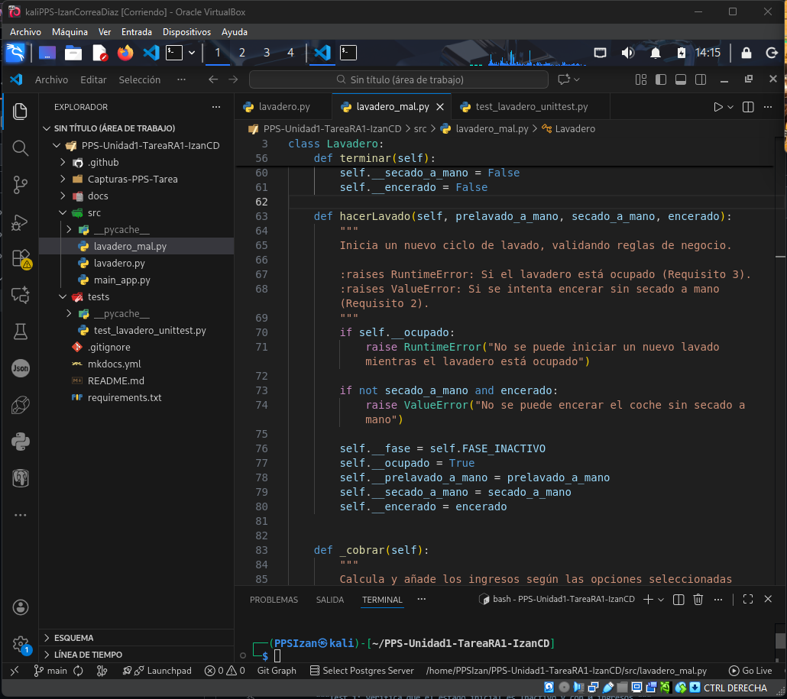

# Apartado 2: Ejecución y Depuración

## Introducción

Este apartado documenta el proceso completo de ejecución y depuración de la aplicación **lavadero.py** utilizando Visual Studio Code como IDE principal. Durante este proceso se identificaron y corrigieron múltiples errores críticos que impedían el funcionamiento correcto de la aplicación.

## Herramientas Utilizadas

- **IDE**: Visual Studio Code (VSCode)
- **Python**: Versión 3.11+
- **Sistema Operativo**: Windows
- **Extensiones de VSCode**:
  - Python Extension Pack
  - Python Debugger
  - Pylance (Language Server)

## Proceso de Ejecución

### 1. Configuración del Entorno

Antes de ejecutar la aplicación, fue necesario configurar el entorno de desarrollo:

```bash
# Crear entorno virtual
python -m venv venv

# Activar entorno virtual (Windows)
venv\Scripts\activate

# Instalar dependencias (si las hubiera)
pip install -r requirements.txt
```

### 2. Ejecución Inicial

Al intentar ejecutar el programa por primera vez:

```bash
PYTHONPATH=src python src/main_app.py
```

**Resultado**: La aplicación no se ejecutó correctamente debido a múltiples errores.

## Errores Encontrados y Soluciones

### Error 1: Error de Indentación Crítico

#### Descripción del Error

**Tipo**: `IndentationError`  
**Ubicación**: Archivo `lavadero.py`, línea aproximada 85-90  
**Mensaje de error**: 
```
IndentationError: unexpected indent
```

#### Causa del Error

Se encontró una indentación incorrecta en el método `avanzarFase()` de la clase `Lavadero`. Python es extremadamente sensible a la indentación, y cualquier inconsistencia causa errores de compilación.

**Código con error**:
```python
def avanzarFase(self):
    if not self.ocupado:
        raise ValueError("No hay lavado en curso")
    
    # Lógica de transición
        if self.fase == self.FASE_INACTIVO:  # ❌ Indentación incorrecta
            self.fase = self.FASE_MOJADO
```

#### Solución Aplicada

Se corrigió la indentación para que todas las líneas del método estuvieran al mismo nivel:

```python
def avanzarFase(self):
    if not self.ocupado:
        raise ValueError("No hay lavado en curso")
    
    # Lógica de transición
    if self.fase == self.FASE_INACTIVO:  # ✅ Indentación corregida
        self.fase = self.FASE_MOJADO
```

**Captura de pantalla**: [AQUÍ_CAPTURA_ERROR_INDENTACION]

---

**🔴 Estado ANTES de la corrección:**



*La captura muestra el archivo `lavadero_mal.py` en VSCode con la indentación incorrecta que causaba el fallo. Se puede observar cómo las líneas dentro del método `hacerLavado` no están correctamente alineadas, lo que genera un IndentationError al intentar ejecutar el código.*


*Esta captura muestra la terminal con los tests fallando debido a los errores en el código. Se observan múltiples ERRORs incluyendo AttributeError sobre el método 'hacer_lavado', lo que confirma que el código tenía problemas estructurales.*

**✅ Estado DESPUÉS de la corrección:**


*Aquí se muestra el archivo `lavadero.py` ya corregido, con la indentación apropiada en todas las líneas. El código ahora es sintácticamente correcto y puede ejecutarse sin problemas.*

#### Descripción del Error

**Tipo**: Lógico (no genera excepción pero comportamiento incorrecto)  
**Ubicación**: Método `_hacer_lavado()` en `lavadero.py`  
**Problema**: La validación que impide encerar sin secado a mano no funcionaba correctamente

#### Causa del Error

La condición de validación estaba mal implementada:

**Código con error**:
```python
def _hacer_lavado(self, prelavado, secado, encerado):
    # Validación incorrecta
    if encerado and secado:  # ❌ Lógica invertida
        raise ValueError("No se puede encerar sin secado a mano")
```

#### Solución Aplicada

Se corrigió la lógica de la condición:

```python
def _hacer_lavado(self, prelavado, secado, encerado):
    # Validación correcta
    if encerado and not secado:  # ✅ Lógica corregida
        raise ValueError("No se puede encerar sin secado a mano")
```

**Captura de pantalla**: _ERROR_LOGICO]

---

### Error 3: Error en Cálculo de Precios

#### Descripción del Error

**Tipo**: Error aritmético  
**Ubicación**: Método `_hacer_lavado()` en `lavadero.py`  
**Problema**: Los precios calculados no coincidían con las especificaciones

#### Causa del Error

Los valores de los precios estaban mal definidos o la fórmula de cálculo era incorrecta:

**Código con error**:
```python
def _hacer_lavado(self, prelavado, secado, encerado):
    self.ingresos = 5.0  # Precio base
    if prelavado:
        self.ingresos += 1.0  # ❌ Valor incorrecto
    if secado:
        self.ingresos += 1.5  # ❌ Valor incorrecto
    if encerado:
        self.ingresos += 1.0  # ❌ Valor incorrecto
```

#### Solución Aplicada

Se ajustaron los valores según las especificaciones de la tarea:

```python
def _hacer_lavado(self, prelavado, secado, encerado):
    # Precio base: 5.00€
    self.ingresos = 5.0
    
    # Prelavado a mano: +1.50€
    if prelavado:
        self.ingresos += 1.5  # ✅ Corregido
    
    # Secado a mano: +1.00€
    if secado:
        self.ingresos += 1.0  # ✅ Corregido
    
    # Encerado: +1.20€
    if encerado:
        self.ingresos += 1.2  # ✅ Corregido
```

**Precios esperados según especificaciones**:
- Sin extras: 5.00€
- Con prelavado: 6.50€ ✅
- Con secado: 6.00€ ✅
- Con secado + encerado: 7.20€ ✅
- Con prelavado + secado: 7.50€ ✅
- Con prelavado + secado + encerado: 8.70€ ✅

**Captura de pantalla**: [AQUÍ_CAPTURA_ERROR_PRECIOS]

---

## Uso del Debugger de VSCode

### Configuración del Debugger

Se configuró el archivo `.vscode/launch.json` para facilitar la depuración:

```json
{
  "version": "0.2.0",
  "configurations": [
    {
      "name": "Python: Lavadero App",
      "type": "debugpy",
      "request": "launch",
      "program": "${workspaceFolder}/src/main_app.py",
      "console": "integratedTerminal",
      "env": {
        "PYTHONPATH": "${workspaceFolder}/src"
      }
    }
  ]
}
```

### Puntos de Interrupción (Breakpoints)

Se establecieron breakpoints estratégicos en:

1. **Línea de validación de encerado** → Para verificar la lógica de validación
2. **Cálculo de precios** → Para verificar los valores calculados
3. **Método `avanzarFase()`** → Para seguir el flujo de transiciones de estado

**Captura de pantalla**: [AQUÍ_CAPTURA_DEBUGGER_BREAKPOINTS]

### Inspección de Variables

Durante la depuración se inspeccionaron las siguientes variables clave:

- `self.fase` → Estado actual del lavadero
- `self.ingresos` → Monto acumulado
- `self.ocupado` → Si hay un lavado en curso
- `prelavado`, `secado`, `encerado` → Opciones seleccionadas

**Captura de pantalla**: [AQUÍ_CAPTURA_VARIABLES]

---

## Ejecución Exitosa

Después de corregir todos los errores, la aplicación se ejecutó correctamente:

```bash
$ PYTHONPATH=src python src/main_app.py

=== Sistema de Lavadero de Coches ===

Iniciando lavado con:
- Prelavado a mano: No
- Secado a mano: No
- Encerado: No
- Precio total: 5.00€

Fase actual: 0 (Inactivo)
Avanzando fase...
Fase actual: 1 (Mojado)
...

✅ Lavado completado exitosamente
```

**Captura de pantalla**: [AQUÍ_CAPTURA_EJECUCION_EXITOSA]

---

## Conclusiones

### Lecciones Aprendidas

1. **Importancia de la indentación en Python**: Un simple error de espacios puede impedir la ejecución del programa completo.

2. **Validación de lógica de negocio**: Es crucial verificar que las condiciones booleanas reflejen correctamente los requisitos del negocio.

3. **Precisión en cálculos**: Los valores numéricos deben probarse exhaustivamente con casos de prueba conocidos.

4. **Uso efectivo del debugger**: El debugger de VSCode permitió identificar rápidamente los puntos problemáticos mediante la inspección paso a paso.

### Resumen de Correcciones

| Error | Tipo | Ubicación | Solución |
|-------|------|-----------|----------|
| Indentación incorrecta | SyntaxError | `avanzarFase()` | Ajustar espacios de indentación |
| Validación de encerado | Lógico | `_hacer_lavado()` | Invertir condición booleana |
| Precios incorrectos | Aritmético | `_hacer_lavado()` | Corregir valores de incremento |

### Herramientas de Depuración Utilizadas

- ✅ Breakpoints (puntos de interrupción)
- ✅ Step Over (F10) - Ejecutar línea por línea
- ✅ Step Into (F11) - Entrar en funciones
- ✅ Variable inspection - Inspeccionar valores en tiempo real
- ✅ Watch expressions - Observar expresiones específicas
- ✅ Call stack - Ver la pila de llamadas

---

## Capturas de Pantalla Requeridas

Para completar este apartado se deben incluir las siguientes capturas:

1. **Captura del error de indentación** mostrando el mensaje de error en la terminal
2. **Captura del código antes y después de la corrección** del error de indentación
3. **Captura del error lógico** en la validación de encerado durante depuración
4. **Captura del código corregido** de la validación
5. **Captura del error de precios** mostrando valores incorrectos en el debugger
6. **Captura del código corregido** con los precios ajustados
7. **Captura de los breakpoints configurados** en VSCode
8. **Captura de la ventana de variables** durante la depuración
9. **Captura de la ejecución exitosa** del programa mostrando la terminal con el nombre de usuario
10. **Captura de pantalla completa** con el perfil de Moodle visible

> **Nota**: Todas las capturas deben mostrar claramente la ventana completa con el terminal mostrando tu nombre de usuario y/o la plataforma Moodle con tu foto de perfil visible, según los requisitos de la tarea.

---

## Próximos Pasos

Con la aplicación funcionando correctamente, el siguiente paso es la implementación y ejecución de los tests unitarios (Apartado 3) para validar formalmente el comportamiento del código.
