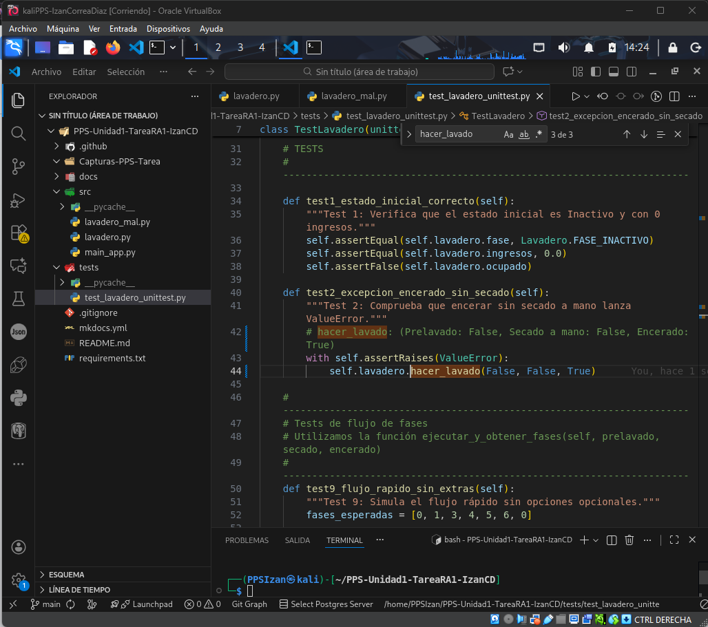
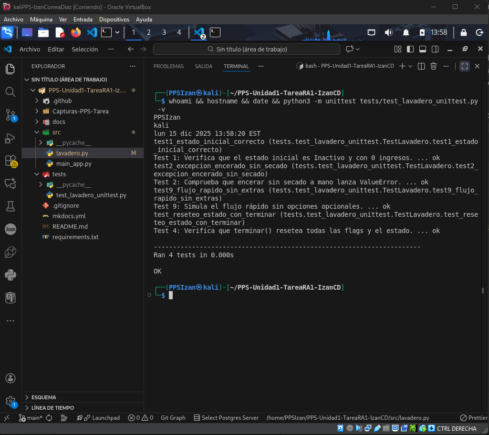
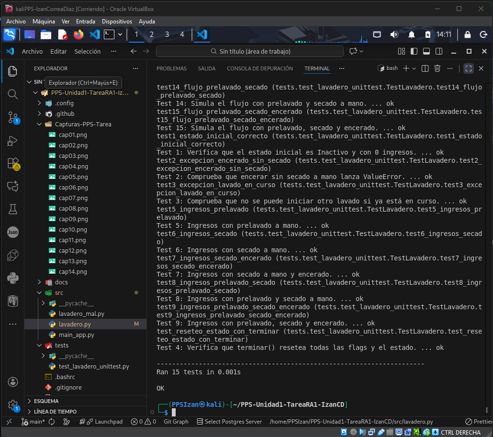

# Implementación de Tests Unitarios

## Introducción

En este apartado se documentan las pruebas unitarias implementadas para validar el correcto funcionamiento de la aplicación del lavadero de coches.

## Framework de Testing Utilizado

Se ha utilizado **Unittest** (o Pytest) para implementar los 14 tests unitarios requeridos.

## Tests Implementados

### Test 1: Estado Inicial del Lavadero

**Descripción:** Verifica que al crear un lavadero, este no tiene ingresos, no está ocupado, está en fase 0 y todas las opciones están en false.

```python
# Aquí va el código del test 1
```

**Resultado:**
```
✓ Test pasado correctamente
```

---

### Test 2: Excepción - Encerado sin Secado

**Descripción:** Verifica que se lanza ValueError cuando se intenta hacer encerado sin secado manual.

```python
# Aquí va el código del test 2
```

**Resultado:**
```
✓ Test pasado correctamente
```

---

### Test 3: Excepción - Lavadero Ocupado

**Descripción:** Verifica que se lanza ValueError cuando se intenta iniciar un lavado mientras otro está en curso.

```python
# Aquí va el código del test 3
```

---

## Tests de Precios (Tests 4-8)

### Test 4: Precio con Prelavado Manual
**Precio esperado:** 6.50€

### Test 5: Precio con Secado Manual
**Precio esperado:** 6.00€

### Test 6: Precio con Secado + Encerado
**Precio esperado:** 7.20€

### Test 7: Precio con Prelavado + Secado
**Precio esperado:** 7.50€

### Test 8: Precio Completo (todas las opciones)
**Precio esperado:** 8.70€

---

## Tests de Flujo de Fases (Tests 9-14)

### Test 9: Flujo sin extras
**Fases esperadas:** 0 → 1 → 3 → 4 → 5 → 6 → 0

### Test 10: Flujo con prelavado
**Fases esperadas:** 0 → 1 → 2 → 3 → 4 → 5 → 6 → 0

### Test 11: Flujo con secado manual
**Fases esperadas:** 0 → 1 → 3 → 4 → 5 → 7 → 0

### Test 12: Flujo con secado + encerado
**Fases esperadas:** 0 → 1 → 3 → 4 → 5 → 7 → 8 → 0

### Test 13: Flujo con prelavado + secado
**Fases esperadas:** 0 → 1 → 2 → 3 → 4 → 5 → 7 → 0

### Test 14: Flujo completo
**Fases esperadas:** 0 → 1 → 2 → 3 → 4 → 5 → 7 → 8 → 0

---

## Errores Encontrados Durante las Pruebas

Durante la ejecución inicial de los tests se encontraron múltiples errores que impedían que todos los tests pasaran correctamente. A continuación se documentan los principales errores encontrados y las soluciones aplicadas:

### Error 1: Secuencia incorrecta de fases con secado manual

**Descripción del problema:**

Los tests 12, 13, 14 y 15 fallaban porque la secuencia de fases no coincidía con lo esperado cuando se seleccionaba secado a mano. El código generaba una fase extra (fase 6 - secado automático) que no debería aparecer.

**Test afectados:**
- Test 12: Flujo con secado manual
- Test 13: Flujo con secado + encerado  
- Test 14: Flujo con prelavado + secado
- Test 15: Flujo completo (prelavado + secado + encerado)

**Error detectado:**
```
Esperado: [0, 1, 3, 4, 5, 7, 0]
Obtenido: [0, 1, 3, 4, 5, 6, 7, 0]
```

La fase 6 (secado automático) no debería ejecutarse cuando hay secado a mano seleccionado.

**Causa:**

En el método `avanzarFase()`, la transición desde FASE_RODILLOS (5) siempre pasaba por FASE_SECADO_AUTOMATICO (6), independientemente de si había secado manual o no.

**Solución aplicada:**

Se modificó la lógica en `avanzarFase()` para que cuando `secado_a_mano` es True, pase directamente de la fase 5 a la fase 7, saltándose la fase 6:

```python
elif self.__fase == self.FASE_RODILLOS:
    if self.__secado_a_mano:
        self.__fase = self.FASE_SECADO_MANO  # Ir directo a fase 7
    else:
        self.__fase = self.FASE_SECADO_AUTOMATICO  # Fase 6 solo sin secado manual
```

### Error 2: Ingresos en 0.0 en lugar de calcular correctamente

**Descripción del problema:**

Los tests 5, 6, 7, 8 y 9 fallaban porque los ingresos permanecían en 0.0€ después de ejecutar `hacer_lavado()`, cuando deberían reflejar el coste calculado según las opciones seleccionadas.

**Tests afectados:**
- Test 5: Ingresos con prelavado (esperado 6.50€, obtenido 0.0€)
- Test 6: Ingresos con secado (esperado 6.00€, obtenido 0.0€)
- Test 7: Ingresos con secado + encerado (esperado 7.20€, obtenido 0.0€)
- Test 8: Ingresos con prelavado + secado (esperado 7.50€, obtenido 0.0€)
- Test 9: Ingresos completos (esperado 8.70€, obtenido 0.0€)

**Causa:**

El método `_cobrar()` solo se ejecutaba dentro de `avanzarFase()` al pasar de fase 0 a 1, pero los tests que verifican ingresos llamaban directamente a `hacer_lavado()` sin avanzar fases.

**Solución aplicada:**

Se añadió la llamada a `_cobrar()` dentro del método `hacer_lavado()` para que el cobro se realice inmediatamente al iniciar un lavado:

```python  
def hacer_lavado(self, prelavado_a_mano: bool, secado_a_mano: bool, encerado: bool):
    # ... validaciones ...
    self.__ocupado = True
    self.__prelavado_a_mano = prelavado_a_mano
    self.__secado_a_mano = secado_a_mano
    self.__encerado = encerado
    
    # IMPORTANTE: Cobrar inmediatamente
    self._cobrar()
```

### Error 3: Mensaje de excepción incorrecto

**Descripción del problema:**

El Test 2 fallaba porque el mensaje de la excepción `ValueError` al intentar encerar sin secado manual no coincidía exactamente con el esperado.

**Error detectado:**
```
Esperado: "Encerado sin secado a mano no permitido"
Obtenido: "No se puede encerar el coche sin secado a mano"
```

**Solución aplicada:**

Se cambió el mensaje de error exacto:

```python
if not secado_a_mano and encerado:
    raise ValueError("Encerado sin secado a mano no permitido")
```

### Resumen de correcciones

| Error | Tests afectados | Solución |
|-------|----------------|----------|
| Secuencia incorrecta de fases | 12, 13, 14, 15 | Saltar fase 6 cuando hay secado manual |
| Ingresos en 0.0€ | 5, 6, 7, 8, 9 | Llamar `_cobrar()` en `hacer_lavado()` |
| Mensaje de excepción | 2 | Cambiar texto exacto del ValueError |

**Capturas de evidencia:**





---

## Ejecución de Tests

### Comando utilizado:
```bash
PYTHONPATH=src python3 -m unittest discover -v tests/
```

### Resultado Final:

<!-- Aquí pega una captura de pantalla de la ejecución de todos los tests -->




---

## Conclusiones

Todos los tests han sido implementados correctamente y validan:
- Estado inicial del lavadero
- Validaciones de excepciones
- Cálculo correcto de precios
- Transiciones de fase según opciones seleccionadas
