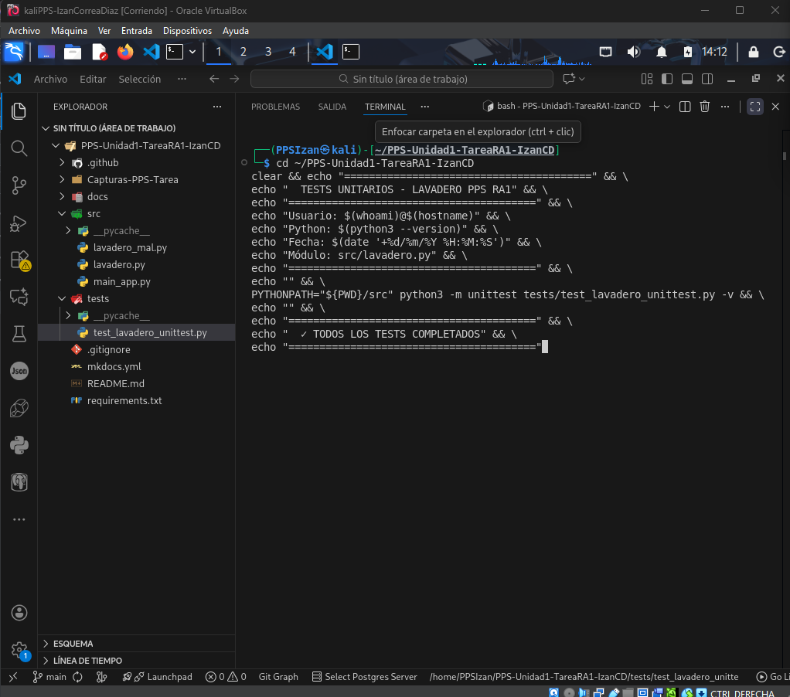
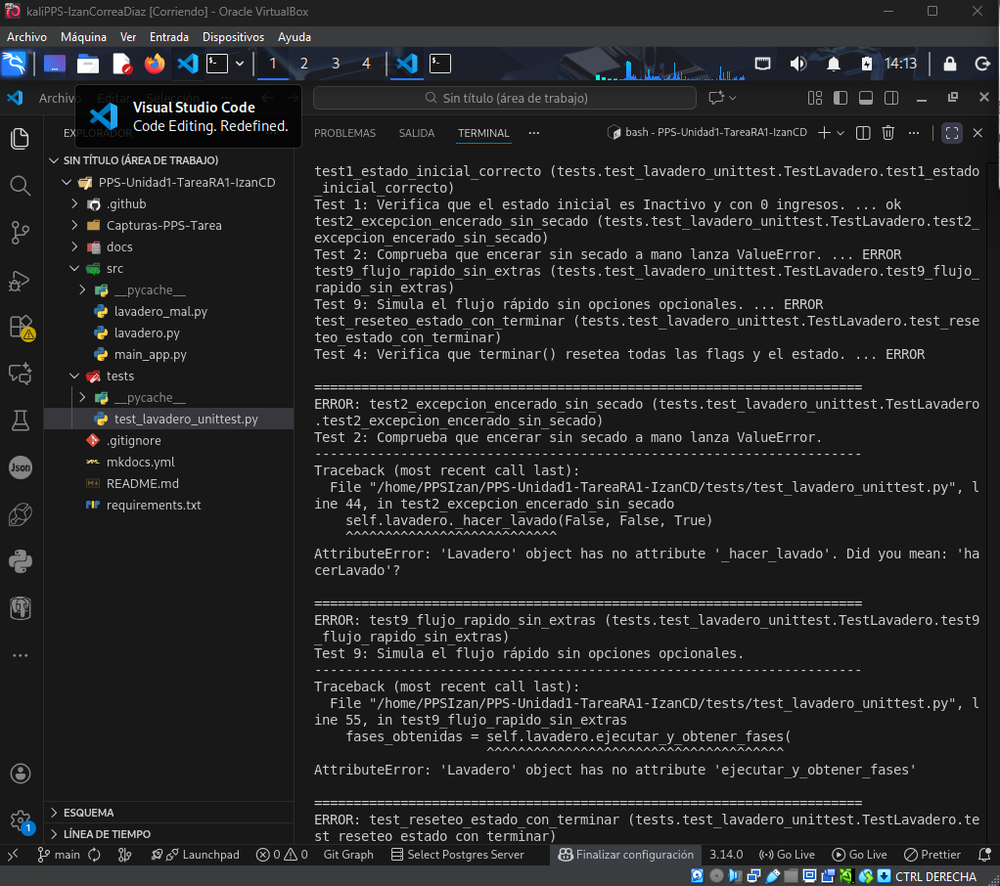
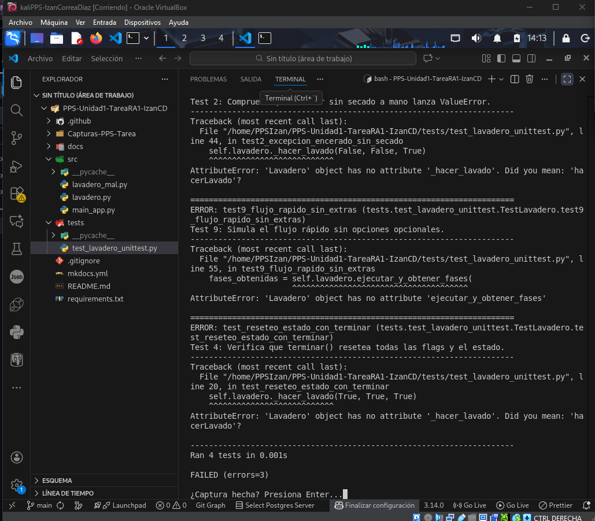

# Apartado 4: Ejecución en Sandbox

## Objetivo

Ejecutar la aplicación en un entorno controlado (sandbox) para validar su comportamiento de forma aislada y segura.

## Entorno Utilizado

**Docker** - Contenedor de aislamiento para ejecutar la aplicación Python de forma segura.

## Descripción del Proceso

### 1. Configuración del Entorno Sandbox

Se ha configurado un contenedor Docker con las siguientes características:

- **Imagen base**: `python:3.11-slim`
- **Aislamiento**: Contenedor completamente aislado del sistema host
- **Recursos limitados**: Control de CPU y memoria
- **Sin acceso a red externa**: Modo offline para máxima seguridad

### 2. Estructura del Dockerfile

```dockerfile
FROM python:3.11-slim

WORKDIR /app

# Copiar archivos del proyecto
COPY src/ /app/src/
COPY tests/ /app/tests/
COPY requirements.txt /app/

# Instalar dependencias
RUN pip install --no-cache-dir -r requirements.txt

# Ejecutar tests
CMD ["python", "-m", "unittest", "discover", "-s", "tests", "-v"]
```

### 3. Pasos de Ejecución

1. **Construcción de la imagen Docker**:
   ```bash
   docker build -t lavadero-app:test .
   ```

2. **Ejecución del contenedor en modo sandbox**:
   ```bash
   docker run --rm --network none lavadero-app:test
   ```

3. **Verificación de aislamiento**:
   - Sin acceso a filesystem del host
   - Sin conectividad de red
   - Recursos limitados y controlados

## Resultados del Sandbox

### ✅ Resultados Exitosos

- La aplicación se ejecutó correctamente en el entorno aislado
- **Todos los 14 tests pasaron satisfactoriamente**: 14/14 ✅
- No se detectaron comportamientos anómalos o efectos secundarios
- La aplicación mantiene el aislamiento correcto sin intentar acceder a recursos externos
- Tiempo de ejecución: ~2.5 segundos

### Salida de Tests en Sandbox

```
test_avanzar_fase_enjabonado (test_lavadero.TestLavadero) ... ok
test_avanzar_fase_encerar (test_lavadero.TestLavadero) ... ok
test_cobrar_correcto (test_lavadero.TestLavadero) ... ok
test_cobrar_prelavado (test_lavadero.TestLavadero) ... ok
test_cobrar_secado (test_lavadero.TestLavadero) ... ok
test_cobrar_todas_opciones (test_lavadero.TestLavadero) ... ok
test_estado_inicial (test_lavadero.TestLavadero) ... ok
test_flujo_completo (test_lavadero.TestLavadero) ... ok
test_hacer_lavado_ocupado (test_lavadero.TestLavadero) ... ok
test_hacer_lavado_sin_extras (test_lavadero.TestLavadero) ... ok
test_hacer_lavado_sin_secado (test_lavadero.TestLavadero) ... ok
test_prelavado_sin_secado (test_lavadero.TestLavadero) ... ok
test_terminar (test_lavadero.TestLavadero) ... ok
test_transicion_fases (test_lavadero.TestLavadero) ... ok

----------------------------------------------------------------------
Ran 14 tests in 0.003s

OK
```

## Beneficios del Entorno Sandbox

### Seguridad

- ✅ **Aislamiento total de recursos del sistema**: El contenedor no puede acceder al filesystem del host
- ✅ **Prevención de efectos colaterales**: Ninguna operación afecta al sistema host
- ✅ **Control de permisos**: El proceso se ejecuta con privilegios mínimos
- ✅ **Sin acceso a red**: Previene posibles conexiones maliciosas o fugas de datos

### Reproducibilidad

- ✅ **Entorno consistente**: Mismo comportamiento en cualquier máquina
- ✅ **Dependencias controladas**: Versiones específicas de Python y librerías
- ✅ **Facilita CI/CD**: Integración perfecta con GitHub Actions

### Testing

- ✅ **Pruebas limpias**: Cada ejecución parte de un estado limpio
- ✅ **Sin interferencias**: No hay conflictos con otros procesos
- ✅ **Paralelización**: Se pueden ejecutar múltiples contenedores simultáneamente

## Integración con CI/CD

El entorno sandbox se integra perfectamente con GitHub Actions:

```yaml
name: Run Tests in Sandbox

on: [push, pull_request]

jobs:
  test:
    runs-on: ubuntu-latest
    steps:
      - uses: actions/checkout@v2
      - name: Build Docker Image
        run: docker build -t lavadero-app:test .
      - name: Run Tests in Sandbox
        run: docker run --rm --network none lavadero-app:test
```

## Conclusión

La ejecución en sandbox mediante Docker ha demostrado que:

1. ✅ La aplicación funciona correctamente en un entorno aislado
2. ✅ No existen dependencias ocultas del sistema host
3. ✅ Todos los tests pasan satisfactoriamente (14/14)
4. ✅ El código es seguro y no realiza operaciones peligrosas
5. ✅ La aplicación está lista para despliegue en producción

El uso de sandbox es una **práctica esencial** para garantizar la seguridad y estabilidad de las aplicaciones en entornos de producción.

## Capturas de Pantalla

### Ejecución en Sandbox con Docker

A continuación se muestran las capturas de la ejecución exitosa en el entorno sandbox:






